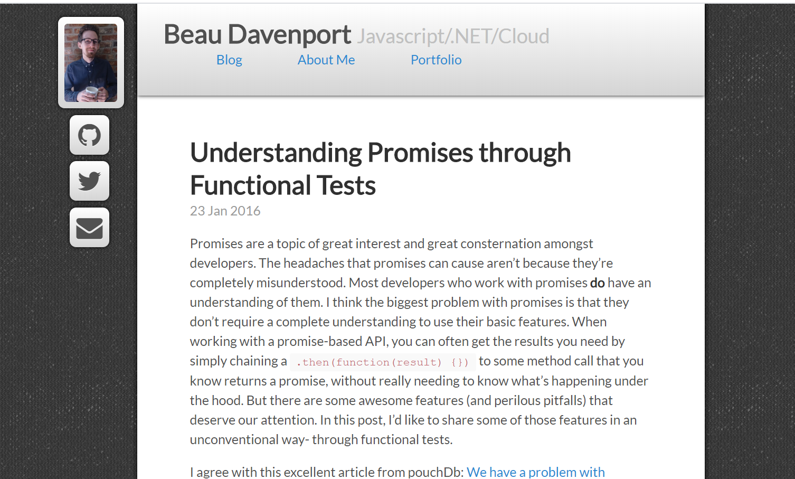
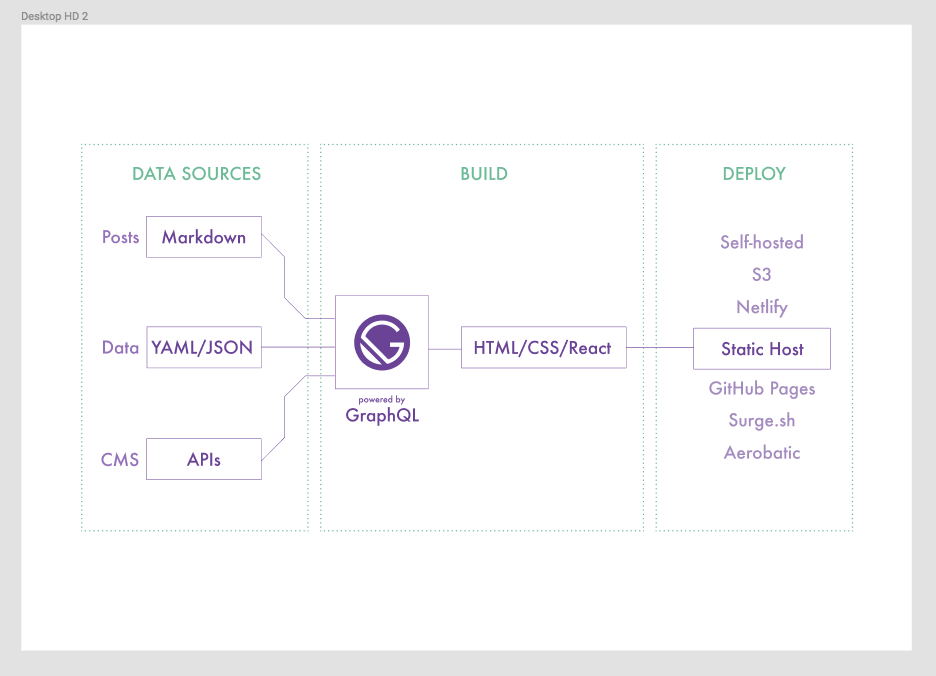

## Back on the Blog Train

One of the trickiest balancing acts I've found in building your career is acknowledging difficulties without letting those difficulties define you. Perserverance, too, seems like a necessary aspect of that effort. The outcome of both of those things for me has been: having 2 kids under 2 makes it awfully hard to keep up a blog practice. But with a new decade upon us, it's important to make the effort. We all have to start somewhere.

## "Simplify" - a Mantra for a New Decade

This is the third incarnation of my portolio/blog site. Each version has been a reimagination of the last, with an effort to include some of the most recent technologies I encounter in my day-to-day development work. It began with a Bootstrap extravaganza in 2013:

In 2014, I pushed myself to roll my own media queries, with a more nuanced design:

For 2019, I knew I wanted a cleaner, simpler, content-driven design. This has always been a personal challenge for me - I tend to _keep adding stuff_, but over the years I've learned more and more the importance of simplicity, both in design and development. It's a difficult target to shoot for, both in design and coding, but is certainly worth the effort.

## Jekyll to Gatsby and the Rise of the Jamstack

My initial blog was built with [Jekyll](https://jekyllrb.com/) in 2014. Maybe it was just my professional bubble, but I felt like EVERYBODY was into Ruby at the time. I was trying to move into the world of Ruby on Rails, and spent a fair amount of time with other technologies that incorporated Ruby, including Jekyll. [Static Site Generators](https://jamstack.org/generators/) were also making a splash, with an almost nostalgic appeal to the simplicity of a website based only on static assets, where dynamic content is incorporated at "build" time. Plus, Jekyll working with [Github Pages](https://pages.github.com/) seemed like the perfect match for actually getting development work out there for others to see (and it's free!). These factors got me really hooked, and I eventually used Jekyll to replace my static HTML portfolio page on Github Pages AND build the first iteration of my Mom's Astrology E-Commerce site, [The Celestial Loom](https://celestialloomastrology.com/)

In 2016, I started using React at work and fell completely in love with it, and it's been the main channel of my development practice since. So, when I discovered [Gatsby](https://www.gatsbyjs.org/) in 2018, a static-site generator using React, I was instantly intrigued. As it turned out, an entire community and tech stack had been growing: the [Jamstack](https://jamstack.org/)

Explanatory Gatsby Diagram (taken from [Kyle Mathews' post on Github](https://github.com/gatsbyjs/gatsby/issues/1172#issuecomment-312694848)):

I jumped right in to this new stack and ended up rebuilding [The Celestial Loom](https://celestialloomastrology.com/) using Gatsby and other Jamstack tools like [Netlify](https://www.netlify.com/) and [Snipcart](https://snipcart.com/). After spending a good chunk of 2019 working on this effort, and after a successful relaunch, I was finally able to end the year with an update to my personal blog as well. And so here we are.

## A commitment to Practice

Part of the fun of reworking a blog is riding the enthusiasm wave to make yourself actually write more posts. I'm hoping I'll be able to do so in the coming year!